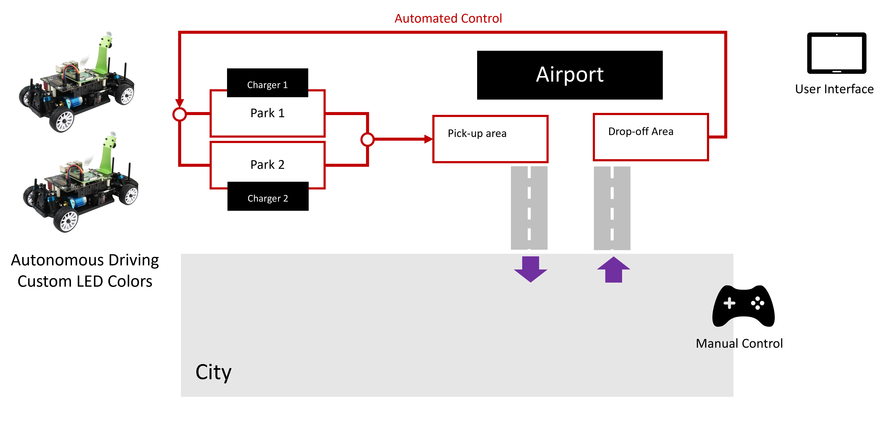

# Project - Airport Experience
## An introduction to Mobility-as-a-Service, Multi-Modal Mobility and Ecosystems.  

# Index

#### [Introduction](#introduction-1)
#### [Background Information](#background-information-1)
#### [Project Goals & Objectives](#project-goals-and-objectives)
#### [Technical Requirements](#technical-requirements-1)
#### [System Architecture](#system-architecture-1)
#### [Project Timeline](#project-timeline-1)
#### [Collaboration and Teamwork](#collaboration-and-teamwork-1)
#### [Mentorship and Support](#mentorship-and-support-1)
#### [Reflection and Self-Assessment](#reflection-and-self-assessment-1)
#### [Results](#results-1)
#### [Submission](#submission-1)
#### [References](#references-1)

# Introduction

This document describes a project to simulate a mobility ecosystem using a customer scenario. The goal of the project is for students to understand the different components of a mobility ecosystem and how they interact with each other to create a seamless transportation experience for customers.

Renting a vehicle in an airport is still a traditional process for many companies: waiting in line, signing documents, checking the license, getting insurance, etc. This process is time consuming and ripe for digitalization.

Car sharing scenarios and business models are being extended to compete with traditional business models like airport rental. In order to disrupt the industry, they have to offer an improved airport experience. This requires the coordination of multiple participants in the mobility ecosystem through applications in the cloud.

This project will use this example to integrating vehicle connectivity, autonomous driving and line of business applications for an enhanced user experience.

# Background Information

In today's world, transportation options are no longer limited to just one mode, such as driving or public transportation. Instead, multi-modal mobility is becoming increasingly popular as people seek more convenient and sustainable ways to travel.

Digital technologies have played a significant role in enabling multi-modal mobility and have revolutionized the way people plan and book their transportation options. By using digital platforms, customers can access real-time information about different modes of transportation, such as schedules, routes, and availability, all in one place.

Furthermore, digital platforms have made it possible for different companies to cooperate and integrate their services to provide a seamless multi-modal transportation experience to customers. For example, a customer may use a single app to book a ride-sharing service to a airport, take a plane to their destination, and then use a car-sharing service to reach their final destination.

However, this level of cooperation between different companies requires careful coordination and integration of digital technologies. Companies need to work together to ensure that their services are interoperable and can seamlessly connect with each other. This includes developing common standards for data sharing, payment systems, and customer information management.

This project will explore the concept of cooperation between different companies using digital technologies for multi-modal mobility in more detail using the integration of a trips planning app, a car sharing company and a semi-autonomous vehicle.

 By the end of the project, students will have a better understanding of how digital technologies are enabling cooperation between different companies to provide a more convenient and sustainable multi-modal transportation experience to customers.

# Customer Scenario

We will create this project based on a near-future  scenario based on a customer **Persona** called Andrea.

*Andrea is a business owner and frequent flyer member. Andrea travels at least once a month for work. Most of these trips are for a short duration.*
*Andrea is a member of a premium subscription-based car service with a fixed monthly  payment. As an add-on package, Andrea can also use rental vehicles in other cities for an additional fee.*

## Scenario Description

[Watch the video](video/airport_experience.mp4)

| Title	| Description	| Notes |
|-------|-------------|-------|
|Travel Preparations	| Andrea is planning a business trip and buys an airline ticket. The email confirmation is automatically added to the travel profile in her **trips app**.|  |
|Reserving a Car | At home, Andrea opens the Contoso Auto App. This app accesses the trip plan and presents a list of vehicle options available on the day at the destination airport. Andrea selects a different vehicle than her usual ride and confirms her selection.	| Reserving the car indicates which of the two vehicles will pick up Andrea when she reaches the curb |
| Landing in Frankfurt |	The flight is delayed by 60 minutes. She arrives in the middle of the night. She only has carry-on luggage, so she proceeds to the ground transportation service and to the designated area for vehicle pickups. The app knows her **location** and **estimated transit time**.	 | Requires simulation of beacons / position of the mobile app to indicate that she has arrived
| Come and pick me up | Meanwhile, her selected vehicle repositions itself automatically. It drives from a **closed staging area** to a **specially designated** location  | When the mobile app is considered “in position”, the selected vehicle will automatically move to the curb area.
| Getting in the Car |	As she reaches the curb on the pick-up area, her selected vehicle is already parked and ready. Andrea unlocks the car with her cell phone |	The transition from “autonomous” to “manual” driving is done using a RFC sensor. The user should be able to drive the car around manually
| It feels familiar  |	The vehicle **automatically downloads her user preferences** and adjusts the seat, temperature, her preferred streaming radio music station and pre-loads the navigation system to her hotel | The car should adjust automatically based on preferences set in the app
| Travelling back home | Andrea’s meetings are completed, she is returning home today! | User can drive the vehicle around manually
| Dropping the Car  | Andrea drives into the designated return area and leaves the vehicle. The vehicle drives automatically into the restricted parking area. Her app notifies her that the vehicle has been **returned successfully**.  | Driving the vehicle into the designated return area yields control of the car. The vehicle returns automatically and a confirmation is send to the app
| Vehicle Processing |As the vehicle enters the restricted parking area, a set of cameras performs a full scan of the vehicle exterior and interior.  | The system documents the state and any potential damage to the car. 	
| Ready for the next customer | The vehicle receives a notification to drive to an available cleaning reception slot. The vehicle state is documented including parameters such as current charge level, mileage and condition. The vehicle returns itself to the pool, ready to be used again. | Vehicle moves automatically to the “washing” designated area, and then moves back into “storage”

# Project Goals & Objectives

## Goals

* To create a  solution that integrates the ecosystem into a single user experience
* To provide students with hands-on experience in developing software solutions for a multi-modal transportation system
* To develop teamwork, communication, and problem-solving skills in students

## Objectives

* Create a Minimum Viable Product that demonstrates the customer scenario
    * Describe and implement communication between multiple parties
    * Communicate with the vehicle
* Create the necessary user interfaces with a focus on customer experience.
    * Reservation of trips
    * Stting user preferences in vehicle
    * Managing a trips history
* Create and implement a sample billing & costing model between companies and to the end customer.
    * Calculate price to customer based on Trips / Distance
    * Calculate costs to car sharing company based on Energy consumption

# Technical Requirements

The *Airport Experience* project requires a combination of software services and hardware to simulate the operation of a mobility ecosystem. The following is a list of the key technical requirements for this project

* At least 2 simulated vehicles with automous driving capabilities (lane following).
    * Manual control of the vehicles using gaming pads.
* Simulated *pick-up* and *drop-off* areas as zones.
* A simualted *closing staging area*.
* Simulated *parking areas* where the vehicle can stop autonomously.
* Routes that the vehicle can follow in automated control.
* Instrumented *charging station* that records the voltage as telemetry.
* User interface (mobile app) for interacting with the system.

By meeting these technical requirements, the *Airport Experience* project will provide the participants in the ecosystem with a basis to demonstrate the interoperatibility of the overall solution.

# System Architecture

The *Airport Experience* project can be divided into 5 main components: the trips management, the car sharing system, the charging infrastructure system, the telemetry platform and the vehicle. The following is a high-level overview of the system architecture and the exchanged messages.

* The trip management component allows customers to schedule, book, and pay for their trips. It triggers reservations in the car sharing system based on a list of available vehicles.
* The car-sharing service provides customers with access to vehicles. It communicates with the telemetry platform to coordinate tasks / mission (pick up a customer in a location). It also keeps the user preferences. It receives the status of the vehicles to control scheduling and trip reports for billing purposes.
* The charging infrastructure ensures the availability of electric vehicles. The car sharing element can coordinate charging (to optimize costs). The charging infrastructure keeps track of consumption for billing.
* The telemetry platform that collects data from the vehicles, processes it in real-time, and provides insights into vehicle usage. It also receives commands for performing a task / mission. It notifies the car sharing platform when it has arrived to a location (geofences). The telemetry platform is also responsible for setting user preferences.

# Project Timeline

A tentative project timeline for the *Airport Experience* project would include the following phases:

1. Planning and Preparation (1 week): This phase involves defining the project scope and objectives. At this point the students take the role of the different companies and describe the interaction and business model.
1. System Architecture and Design (2 weeks): This phase involves developing the system architecture and design, including the interfaces between the different systems.
1. Development and Integration (6 weeks): This phase involves developing and integrating the hardware and software components of the project.
1. Testing and Debugging (2 weeks): This phase involves inhtegration testing of the interfaces between the different systems.
1. Final report (1 week): Create project report and presentations. 

# Collaboration and Teamwork

In this project, students must divide themselves into at least 3 teams that each takes the role of a different company. Besides demonstrating the technical implementation of the solution, the solution must include the business model aspects of the interaction between the companies.

Each team member will be assigned specific tasks and responsibilities, and will be expected to contribute to the overall success of the project. Teams will be required to submit regular progress reports and to meet with the instructor for check-ins and feedback. 

# Mentorship and Support

Students will be provided with mentorship and support from the instructor throughout the project. The instructor will be available for questions and guidance, and will hold regular check-ins and progress reports to provide feedback and support.  
 

# Reflection and Self-Assessment

Students will be encouraged to reflect on their own learning and progress throughout the project. This will be done through self-assessment exercises and through feedback from the instructor and other team members.  
 

# Submission

At the end of the *Airport Experience* project, students will submit the following artifacts to GitHub:

1. Source Code: The source code for the hardware and software components of the *Airport Experience* project, organized by companies.
1. Documentation: Detailed documentation for the project, including system architecture, design documents, testing procedures, user manuals, and implementation guides.
1. Test Cases: Test cases and test results for the project, demonstrating the reliability and accuracy of the system.
1. User Interface Design: The design and user interface specifications for the project, including wireframes, mockups, and prototypes.
1. Business plan: A document that describes the business plan and billing strategies between the companies.
1. Project Plan: The project plan and timeline, including detailed task lists, resource allocation, and risk management strategies.
1. Presentation: A presentation summarizing the projectt, including an overview of the system architecture, technical specifications, user interface, and test results.
1. Final Report: A final report detailing the results of project, including technical specifications, system performance, user feedback, and lessons learned.

These artifacts would provide a comprehensive overview of the *Airport Experience* project, including the technical details, design decisions, and testing results, and would allow others to replicate the project or build upon it in the future.

# References
text

Shield: [![CC BY-NC-SA 4.0][cc-by-nc-sa-shield]][cc-by-nc-sa]

This work is licensed under a
[Creative Commons Attribution-NonCommercial-ShareAlike 4.0 International License][cc-by-nc-sa].

[![CC BY-NC-SA 4.0][cc-by-nc-sa-image]][cc-by-nc-sa]

[cc-by-nc-sa]: http://creativecommons.org/licenses/by-nc-sa/4.0/
[cc-by-nc-sa-image]: https://licensebuttons.net/l/by-nc-sa/4.0/88x31.png
[cc-by-nc-sa-shield]: https://img.shields.io/badge/License-CC%20BY--NC--SA%204.0-lightgrey.svg
